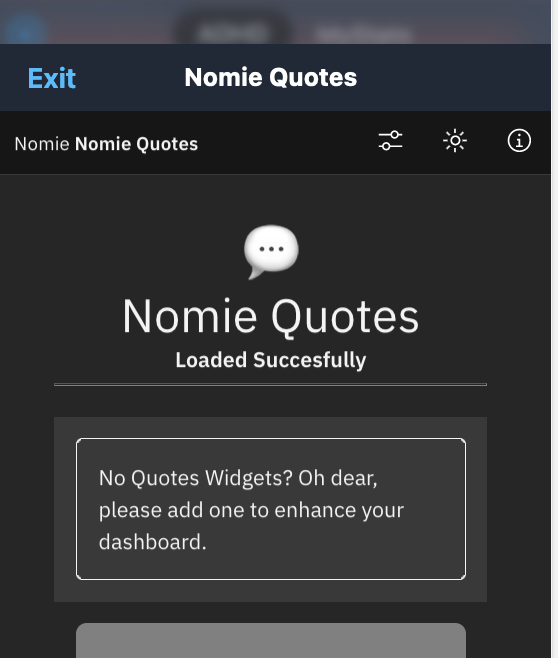
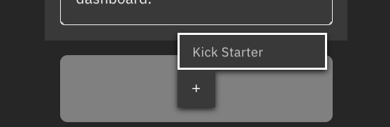
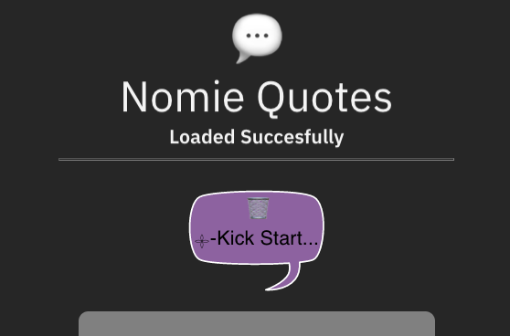
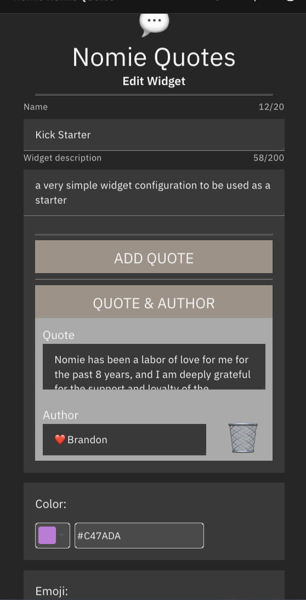
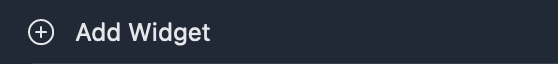
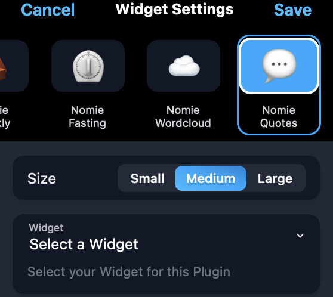
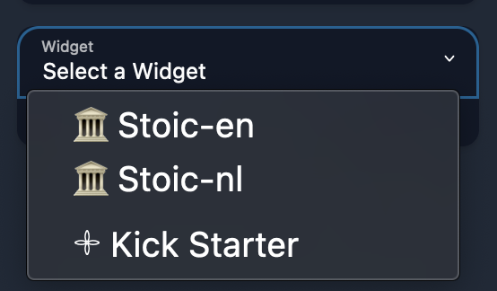
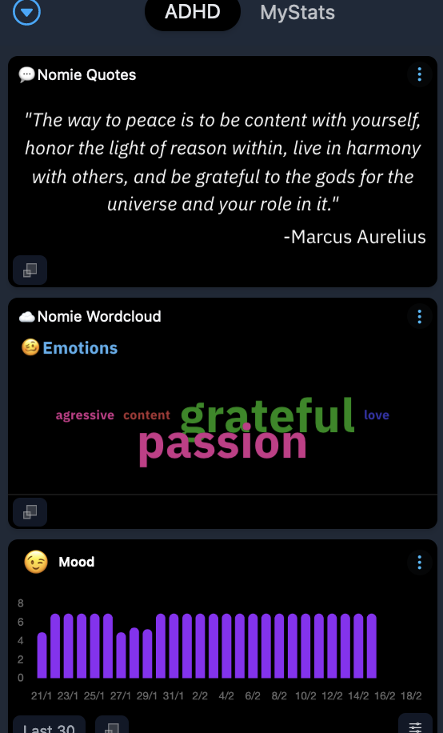

# 💬 Nomie Quotes Plugin

The 💬Nomie Quotes Plugin is a plugin for Nomie6-oss.

## About the 💬Nomie Quotes Plugin

The Nomie Quotes plugin introduces a new widget for the Nomie Dashboard. The plugin let's you add Widgets with Quotes on the dashboard. These quotes will be generated by user configured sets of quotes.

The Plugin comes with 2 predefined quotes lists and will let you create as many custom lists with quotes as you would like.

## Installing the Plugin

The url of the plugin is:

[https://dailynomie.github.io/nomie-plugin-widget-quotes/](https://dailynomie.github.io/nomie-plugin-widget-quotes/)

The 💬Nomie Quotes Plugin can be installed in Nomie via the following steps:

* Go to the More Tab
* Select Plugins
* Click the + or Add Custom Plugin
* Provide the url for the plugin
* Tap Install Plugin

## How to use the 💬Nomie Quotes Plugin

After installing the Plugin, please open the plugin to initialise the plugin and configure your first list of quotes.

Due to the setup of the Nomie plugin engine, the plugin should be openened first in order to be able to add Quotes widgets to your dashboard.

When the plugin is opened you will be presented with an empty dashboard:

Please click on the button to add your first Quote list. You will be requested to choose a template. Currently only the Kick Starter template is available:

After clicking the Kick Starter template you will get the following screen with the Kick Starter Quote List added:

Now, click on the purple speech balloon to configure this quote list:

You can now change the configuration:

### Name

This defines the name of your Quote list, please provide a name which you will recognise when you will add the widget to your dashboard later.

### Description

Provide a short description of the content of the quote list.

### The Quotes

This is an important setting, the Kick Starter templates comes with an initial quote as part of our quote list. By clicking on the Add Quote button you can add additional quotes.

By using the trash icon you can remove individual quotes from the list.

### Color & Emoji

These fields let you choose the color of the speech balloon on your plugin dashboard and an emoji representing this quote list.

### Save

After configuring your settings, please click on the save button at the bottom of the screen... and you are done.

## Adding a Quote widget to the Dashboard

Now that you have configured your first quote list, you can add a daily random quote to the Nomie Dashboard as a Widget.

Please be aware that there are already 2 predefined quote lists included in the Plugin:

* Stoic-en: a complete list of Stoic quotes in English
* Stoic-nl: the same list, but now in Dutch

In order to add a Quote Widget to your dashboard, please first go to your dashboard and choose 'Add Widget':

You will be directed to the following screen, please click on the Quotes Widget:

Now, please click on the Select a Widget selection field. You will be presented with the predefined quote lists and your own created lists:

For this example I picked the 🏛️Stoic-en list. Now, please click on the 'save' option in the top right corner.

The Quotes Widget is now added tou your Nomie Dasboard:

### Bonus feature

You can click on the quote in the widget which will bring you to the Nomie Note editor with the quote already prefilled, so you can add your own thought to reflect on the specific quote.

### Final words

I guess there is not much more to say about this Plugin. As always, have fun with this plugin!
